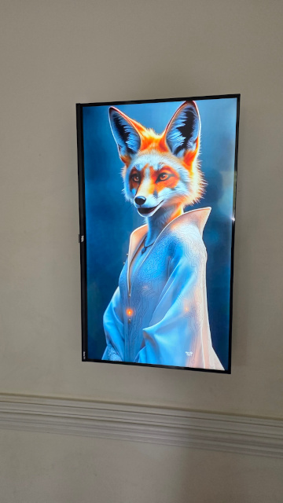
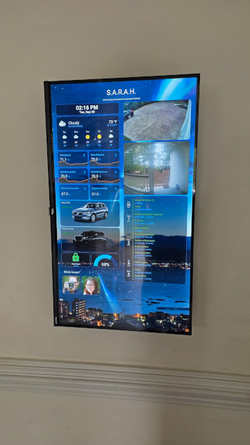
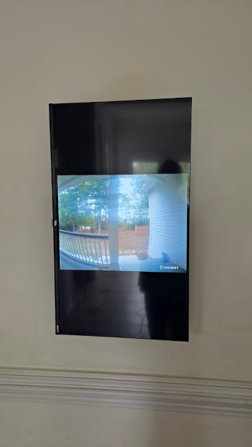
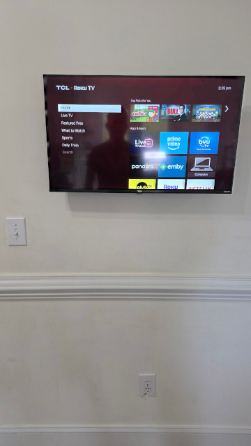
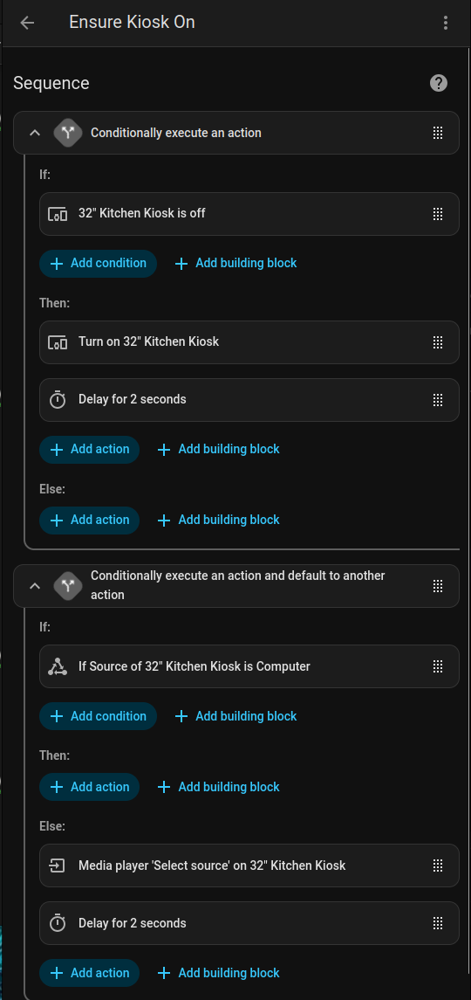

# HA-Kiosk
Scripts and options to run an AI avatar with a dashboard in Kiosk mode on Linux

Shield: [![CC BY-NC 4.0][cc-by-nc-shield]][cc-by-nc]

This work is licensed under a
[Creative Commons Attribution-NonCommercial 4.0 International License][cc-by-nc].

[![CC BY-NC 4.0][cc-by-nc-image]][cc-by-nc]

 

[cc-by-nc]: https://creativecommons.org/licenses/by-nc/4.0/
[cc-by-nc-image]: https://licensebuttons.net/l/by-nc/4.0/88x31.png
[cc-by-nc-shield]: https://img.shields.io/badge/License-CC%20BY--NC%204.0-lightgrey.svg

## **NOTE!!!!  I DO NOT PROVIDE SUPPORT FOR THIS CODE, USE AT YOUR OWN RISK** 
If you are unable to make this work, I just plain don't have the time or inclination to assist.  I'm packaging
up what I've created for others to tinker with, not to provide a finished product.

I've tried to add some basic protection so that if your HA instance is compromised they can't use the API to 
take over the kiosk machine as well, but there's no guarantees.  Definitely don't connect the machine running
this code directly to the Internet, or do so at your own risk with the knowledge you'll likely be compromised.

My point being: I didn't spend much time adding any sort of protections or security to this code.  It goes
on the assumption it will only run within a private segregated environment of your house without Internet 
interference.

# What is it?

 

This project contains a REST API application written in Python, and a series of bash scripts that it calls
to perform various actions.  It's designed to be called by Home Assistant automations to give you more
control over a PC running a dashboard.  The concept is to have a display screen and use automations and HA Voice for control,
not to install a huge touchscreen.

***Features:***
HA Automations will be able to:
* play full screen videos of the Avatar saying something on the Kiosk (videos not included)
* play a full screen avatar video followed by a camera RTSP stream for a timeperiod
* Manage power and inputs on the Roku TV in relation to these acts
* Play a slideshow screensaver
* Act as a nightlight at night with a special screensaver mode

***Why have just text to speech for common things when your house can have an avatar?***
I suspect within a few months to a year it'll be trivial to replace the hard coded videos with realtime generated AI videos of the house avatar.

I recommend you do what I do and run the Kiosk machine with this code on a VLAN
that does not have Internet access and can only reach your HA installation and cameras.  It's a best practice to
keep all your IoT on a VLAN.

Also **Be aware there is no authentication on the REST API!!!**  This is another reason to have it on a VLAN.  Feel free to add your
own authentication method if you want authentication on the REST API calls.

# How do I get started?
This expects a few things:
* Home Assistant up and running (duh!  lol)
* Voice control of HA
* A Linux Mint Xfce-based installation.  I chose Xfce due to it being lightweight / smaller and we don't really need much of a desktop GUI.
* Firefox, ffmpeg, and mpv installed on the Linux machine.
* A static private IP on the Linux machine, or a valid internal DNS name that will always reference it.
* A static private IP on the Roku TV that will display the Kiosk.
* Some videos and photos for the AI avatar and slideshow.  I don't supply those.
* Optionally, a window/door contact sensor that works in your HA.  This is used to detect screen orientation.
* A decent amount of both HA and Linux experience.

## Avatar video AI generation
I created my videos of the anthropomorphic fox in portrait mode using the low quality (cheap) output option from https://app.heygen.com/ and then upscaled to 1080x1920 and sharpened with Handbrake.

## Hardware I used:
* A PC.  I used one of these, but notice it's ethernet only, no wifi.  You may need something with wifi:  https://www.amazon.com/dp/B07FKMJGD6
* A wireless HDMI transmitter pair.  I went with 2 receivers:   https://www.amazon.com/dp/B0DKK4ZN44
* A TV mount that rotates:  https://www.amazon.com/dp/B0C3JYPFZF
* A Roku TV.  I'm not thrilled at how thick this one is, but it was cheap and 32": https://www.amazon.com/dp/B0C1J1FS2C
* A window/door contact to detect rotation of the TV:  https://www.amazon.com/dp/B0DMPX7KSQ
* Optionally get a wall outlet kit for giving power without wires showing behind the TV.  If not an electrician, hire one.

## Configuring the Linux PC
I recommend a fresh install of Linux Mint Xfce.  There's a few tweaks to make:
* Setup a single user account on this and configure it to auto-login as that user without a password needed
* DO set a password for the user - that will help protect the "root" access.
* Install the following: 
   `sudo apt install ffmpeg mpv firefox python python3 python3-flask python-is-python3 python3-pip python3-validators`
* Place all the files from this project into the home directory of your user, retaining the folder tree.  Aka, you'll have ~/Scripts/ once done.

### Startup Applications
In the Xfce startup applications (in settings) add the following:
* `~/Scripts/killpanel.sh`  (This gets rid of the Xfce application bar after login.  You may want to wait until everything works right to do this.)
* `~/REST/restserver.sh`
* `/usr/bin/firefox --kiosk https://[your HA instance]:[port]/dashboard-kiosk/`

Feel free to disable any default startup applications of things you won't need.  For instance, I don't need bluetooth.

### Edit the following files
* Modify the ~/Scripts/try_noscreen.sh file to contain the correct IP address of your Roku TV that will run the Kiosk

### Define a couple of items in crontab:
``` crontab
*/15 6-20 * * * ~/Scripts/try_slideshow.sh >/dev/null 2>&1
*/15 21-23,0-5 * * * ~/Scripts/try_noscreen.sh >/dev/null 2>&1
0 6 * * * rm ~/Scripts/nightlight.txt >/dev/null 2>&1
```

### Configure the Roku
Set your Roku TV on a static IP.  Assign the name "Computer" to HDMI1 input (or don't and change the automations.)
Set the default Roku TV input to the HDMI1, now called "Computer"  That way every time it's turned on, it will start at the dashboard.
Set the options on the Roku to network permissive for control.  Again, having it on a VLAN along with the Kiosk PC is recommended.
Set up the Roku integration in HA.

Feel free to edit that schedule as you see fit.  My Kiosk is configured to turn off at 9PM.  The try_noscreen.sh is simply to ensure that later on if it came back on for some reason it turns itself back off.  The slideshow screensaver is set to run primarily during wake hours.  The nightlight.txt "flag" gets removed at 6AM which is when I have the Kiosk come back on in the mornings.

### Finally, reboot the Kiosk PC

# Setup your scripts and automations in HA
I've tried to put as many of the options and such into HA to make it easier to edit this on the fly without having to restart HA or the like.

# Set up a dashboard for the Kiosk
Create a new non-admin user in HA for the Kiosk to login as, and login from the Kiosk PC as that user and save the password in the browser.  I recommend enabling 2FA on the account.
Create a new dashboard to display whatever you'd like to see.  Install the "browser_mod" integration in HA and configure the user that logs in from the Kiosk to hide the header/sidebar.  This will give a very clean "kiosk" mode.  Be sure that the path in the startup application for Firefox that gets opened on the Kiosk PC matches the path to the new dashboard.


## configuration.yaml
You will need to modify your configuration.yaml file on the HA server to add the following code.  Substitute the IP address of the new Linux Kiosk PC:

```yaml
rest_command:
  kiosk_rest:
    url: "http://[kiosk-pc]:5000/run/{{script}}"
    method: post
    headers:
      user-agent: "Mozilla/5.0 {{useragent }}"
    content_type: 'application/json; charset=utf-8'
    payload: '{"args":["{{args1}}","{{args2}}"]}'
```

***NOTE: I couldn't ever get the REST payload working as a proper array passed from an automation so I hard-coded in two arguments that get inserted into the JSON.  Someone with more smartness than me is welcome to let me know the proper way to do that and I'll happily update this.***

Now, restart your Home Assistant server or otherwise reload your configuration.

## Helper script for the TV control
You'll need to create a script (under Settings/Automations & Scenes/Scripts called "Ensure Kiosk On"

I believe all of this script can be done in the GUI but I'll post both a screenshot and the YAML I use:


```yaml
sequence:
  - if:
      - condition: device
        type: is_off
        device_id: 7b75a14e9977927a64bf24a7038b79f4
        entity_id: 1c5f3a09bb55b87967bbef7c695a7b8f
        domain: remote
    then:
      - type: turn_on
        device_id: 7b75a14e9977927a64bf24a7038b79f4
        entity_id: 1c5f3a09bb55b87967bbef7c695a7b8f
        domain: remote
      - delay:
          hours: 0
          minutes: 0
          seconds: 2
          milliseconds: 0
  - if:
      - condition: state
        state: Computer
        entity_id: media_player.32_kitchen_kiosk
        attribute: source
    then: []
    else:
      - action: media_player.select_source
        metadata: {}
        data:
          source: Computer
        target:
          device_id: 7b75a14e9977927a64bf24a7038b79f4
      - delay:
          hours: 0
          minutes: 0
          seconds: 2
          milliseconds: 0
alias: Ensure Kiosk On
description: ""
```

The above script simplifies the automations that you will create.

## Configure a few automations
Here's some example YAML, but you can use the GUI entirely for configuration except for when entering the REST API call parameters:

First, you'll need two automations for handling the physical rotation of the TV.  Be sure you're picking your own Roku device and not trying to paste in my device_id:
```yaml
alias: Kiosk Rotate to Dashboard
description: ""
triggers:
  - trigger: state
    entity_id:
      - binary_sensor.kiosk_tilt_window_door_is_closed_2
    from: "off"
    to: "on"
conditions: []
actions:
  - action: script.ensure_kiosk_on_input
    metadata: {}
    data: {}
  - action: remote.send_command
    metadata: {}
    data:
      command: input_hdmi1
    target:
      device_id: 7b75a14e9977927a64bf24a7038b79f4
  - action: rest_command.kiosk_rest
    metadata: {}
    data:
      script: dashboard
      arg1: ""
      arg2: ""
mode: single
```

```yaml
alias: Kiosk Rotate to Roku
description: ""
triggers:
  - trigger: state
    entity_id:
      - binary_sensor.kiosk_tilt_window_door_is_closed_2
    from: "on"
    to: "off"
conditions: []
actions:
  - action: remote.send_command
    metadata: {}
    data:
      command: home
    target:
      device_id: 7b75a14e9977927a64bf24a7038b79f4
mode: single
```


This automation works from my Amcrest integration when the doorbell sees a human being.  You will need to supply your own RTSP URL for your front door camera to use this.
It also uses a notification group I created called "notify_tony" that points to my current cellphone for pinging it as well.  More an example than anything you could copy/paste and use.
The "Door" script name passed in the Rest signifies for it to look under ~/Videos/Door/ and play a random video file for the avatar.
```yaml
alias: Doorbell Human
description: ""
triggers:
  - entity_id:
      - binary_sensor.doorbell_human
      - camera.doorbell
    to: "on"
    from: "off"
    trigger: state
conditions: []
actions:
  - action: script.ensure_kiosk_on_input
    metadata: {}
    data: {}
  - action: rest_command.kiosk_rest
    metadata: {}
    data:
      script: playstream
      args1: Door
      args2: rtsp://[username]:[password]@[nvr-ip-address]:[port]/rtsp/streaming?channel=02
  - action: notify.notify_tony
    data:
      message: Human detected
      data:
        channel: Motion
        ttl: 0
        priority: high
```

This one will cause the Kiosk to stop whatever it's doing and show the dashboard:
```yaml
alias: Show Dashboard Command
description: ""
triggers:
  - trigger: conversation
    command:
      - show dashboard
      - display dashboard
      - show dashboard please
      - display dashboard please
      - dashboard
conditions: []
actions:
  - action: script.ensure_kiosk_on_input
    metadata: {}
    data: {}
  - action: rest_command.kiosk_rest
    metadata: {}
    data:
      script: dashboard
mode: single
```
This one will activate "nightlight" mode where it keeps the screen on all night playing a slideshow:
```yaml
alias: Nightlight mode
description: ""
triggers:
  - trigger: conversation
    command:
      - nightlight please
      - nightlight
      - nightlight mode
      - the kids are here
conditions: []
actions:
  - action: script.ensure_kiosk_on_input
    metadata: {}
    data: {}
  - action: rest_command.kiosk_rest
    metadata: {}
    data:
      script: nightlight
      args1: ""
      args2: ""
mode: single
```
And you can get a bit more complicated.  The "playavatar" call will trigger the kiosk to play a given avatar video.  For instance, one that announces a garage door has been left open.  The second condition and the action are related to turning on the Kiosk display if it's currently off.
```yaml
alias: Garage Door Left Open Announcement
description: ""
triggers:
  - to: open
    for:
      hours: 0
      minutes: 15
      seconds: 0
    entity_id: cover.nissan
    trigger: state
  - trigger: state
    entity_id:
      - cover.volvo
    to: open
    for:
      hours: 0
      minutes: 15
      seconds: 0
conditions:
  - condition: and
    conditions:
      - condition: numeric_state
        entity_id: zone.home
        above: 0
      - condition: device
        type: is_off
        device_id: 7b75a14e9977927a64bf24a7038b79f4
        entity_id: 1c5f3a09bb55b87967bbef7c695a7b8f
        domain: remote
actions:
  - type: turn_on
    device_id: 7b75a14e9977927a64bf24a7038b79f4
    entity_id: 1c5f3a09bb55b87967bbef7c695a7b8f
    domain: remote
  - delay:
      hours: 0
      minutes: 0
      seconds: 4
      milliseconds: 0
  - action: rest_command.kiosk_rest
    metadata: {}
    data:
      script: playavatar
      args1: Garage
  - action: script.notify_volvo_door
    metadata: {}
    data:
      title: "{{ trigger.to_state.attributes.friendly_name }} opened"
      message: Would you like to close it?
      entity_id: "{{ trigger.entity_id }}"
mode: single
```

# Possible REST API commands
* playstream: This will play a random Avatar video from the specified folder, followed by a camera RTSP stream for 20 seconds.  Pass the avatar folder and the RTSP URL in args1 and args2.
* playavatar:  This will play a random Avatar video from the specified folder.
* dashboard:  Stops everything and displays the dashboard.
* noscreen: Used by HA when turning off the TV for the night.
* start_slideshow: Start the slideshow screensaver.
* nightlight: Trigger the nightlight mode slideshow/screensaver.
* listening:  Hides everything and shows the desktop briefly to be used during voice recognition as feedback.  I placed a static image of my AI avatar as the desktop wallpaper.
* rotate_roku:  Triggers that we are rotating to the Roku TV mode / landscape mode.
* rotate_dashboard:  Triggers rotating back to the dashboard portrait mode.

Note that the nightlight mode script is still a short hack without the random avatar selection and has a hardcoded path to the slideshow to use.  Feel free to modify.
